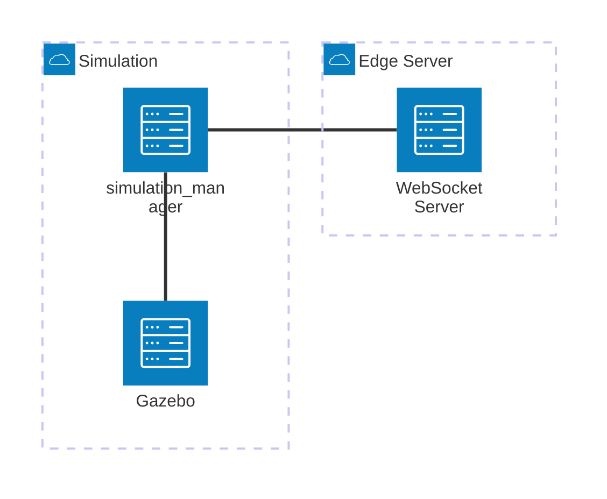

# Simulation Architecture

**Status:** Partial

Core `simulation_manager` components are partially implemented.

## 1. Overview

The Simulation subsystem provides the simulation environment for the AMR system.

It is composed of:

- `simulation_manager`
- Gazebo

`simulation_manager` is responsible for managing the lifecycle and runtime state of simulated AMRs.

The Simulation subsystem communicates with:

- Gazebo
- Edge Server

The Simulation subsystem does not communicate with the Cloud Platform directly.

It does not use MQTT for simulation control or synchronization.

---

## 2. Architecture



## 2.1 Status

V1 implemented components:

- `simulation_manager`
- `AmrProcessManager`
- `RobotLifecycleManager`
- `RobotSyncManager`
- `GazeboClient`
- `ControllerChecker`
- `WebSocketClient`

The WebSocket `robot_list` protocol uses `instance_id` as the simulation instance field.

### Communication

```text
Simulation Manager
       │
       ├── WebSocket ──────► Edge Server
       │
       └───────────────────► Gazebo
```

The WebSocket connection is used for synchronization between the simulation environment and the Edge Server.

Gazebo is controlled directly by `simulation_manager`.

---

## 3. Simulation Manager

`simulation_manager` is the central controller of the simulation subsystem.

Its main responsibilities are:

* Managing simulated AMR processes
* Managing simulated AMR lifecycle
* Synchronizing simulated robots with Edge Server
* Communicating with Gazebo
* Monitoring robot/controller state
* Handling simulation-specific robot information
* Maintaining the relationship between simulated robots and Edge robots

The Simulation Manager does not implement warehouse business logic.

It does not:

* Execute AMR tasks
* Perform AMR navigation
* Manage AMR battery logic
* Manage AMR traffic decisions
* Communicate with AMRs through MQTT

---

## 4. Internal Components

The Simulation Manager is internally divided into several components.

```text
                     simulation_manager
                              │
        ┌─────────────────────┼─────────────────────┐
        │                     │                     │
        ▼                     ▼                     ▼
Robot Lifecycle          Robot Sync             Gazebo
   Manager                  Manager              Client
        │                     │                     │
        ▼                     ▼                     ▼
AMR Processes           Edge Server             Gazebo
```

Current major components include:

* `RobotLifecycleManager`
* `RobotSyncManager`
* `AmrProcessManager`
* `GazeboClient`
* `ControllerChecker`

---

## 5. Robot Lifecycle Management

### RobotLifecycleManager

`RobotLifecycleManager` manages the lifecycle of simulated AMRs.

Responsibilities include:

* Starting simulated AMRs
* Stopping simulated AMRs
* Restarting simulated AMRs
* Tracking AMR process state
* Managing simulation robot instances

The lifecycle manager does not manage the business state of the real AMR.

It only manages the simulation-side process lifecycle.

---

## 6. AMR Process Management

### AmrProcessManager

`AmrProcessManager` manages the actual AMR processes launched by the simulation environment.

A simulated AMR may be started as an independent ROS2 process group.

The process manager is responsible for:

* Building AMR launch commands
* Starting AMR processes
* Stopping AMR processes
* Monitoring process state
* Handling process failures

The simulation environment should treat the AMR application as an independent runtime component.

---

## 7. Gazebo Integration

### GazeboClient

`GazeboClient` provides the interface between `simulation_manager` and Gazebo.

Responsibilities include:

* Spawning AMR models
* Removing AMR models
* Querying simulation state
* Interacting with Gazebo services/APIs
* Managing simulation model information

The simulation manager uses Gazebo to provide the physical simulation environment.

```text
simulation_manager
        │
        ▼
   GazeboClient
        │
        ▼
      Gazebo
```

---

## 8. Controller Monitoring

### ControllerChecker

`ControllerChecker` verifies whether the required ROS2 controllers of a simulated AMR are available and operating correctly.

Typical responsibilities include:

* Checking controller availability
* Checking controller state
* Detecting controller startup failures
* Providing controller status to the simulation manager

The controller checker is a simulation infrastructure component.

It does not implement AMR navigation or behavior logic.

---

## 9. Robot Synchronization

### RobotSyncManager

`RobotSyncManager` maintains synchronization between the simulation environment and the Edge Server.

The simulation manager periodically reports the simulated robot list and related information to the Edge Server.

Typical flow:

```text
Simulation Manager
        │
        │ WebSocket
        ▼
   Edge Server
```

The synchronization mechanism allows the Edge Server to understand which simulated AMRs currently exist in the warehouse simulation.

---

## 10. Simulated AMR Identity

Each simulated AMR has two identifiers:

```text
robot_id
instance_id
```

The simulation model name is generated using:

```text
amr_<robot_id>_<instance_id>
```

For example:

```text
robot_id   = robot01
instance_id = A001

Gazebo model:
amr_robot01_A001
```

This allows multiple simulated instances of the same AMR identity to be distinguished.

---

## 11. AMR Process Launch

The Simulation Manager can launch an AMR using the AMR ROS2 launch system.

Example:

```text
spawn_amr.launch.py
    │
    ├── robot_id:=robot01
    └── instance_id:=A001
```

The resulting simulated robot uses its own ROS2 namespace and robot-specific resources.

For example:

```text
/robot01/robot_description
/robot01/controller_manager
```

The Gazebo model uses:

```text
amr_robot01_A001
```

---

## 12. Simulation and Edge Interaction

The Simulation Manager communicates with the Edge Server through WebSocket.

The communication is intentionally separated from the AMR communication channel.

```text
                    Edge Server
                         ▲
                         │
                     WebSocket
                         │
                         ▼
                Simulation Manager
                    │           │
                    │           │
                    ▼           ▼
                 Gazebo      AMR Processes
```

The architecture intentionally avoids:

```text
Simulation Manager
        │
        ▼
      MQTT
        │
        ▼
    Edge Server
```

Simulation synchronization is a simulation infrastructure concern and does not use the AMR MQTT communication channel.

---

## 13. Relationship with AMR

The simulated AMR application itself is still an independent ROS2 system.

The Simulation subsystem is responsible for providing the simulation environment and managing its lifecycle.

```text
                    Simulation
                         │
                  simulation_manager
                         │
              ┌──────────┴──────────┐
              ▼                     ▼
           Gazebo              AMR Process
                                    │
                                    ▼
                                  ROS2
                                    │
                   ┌────────────────┼────────────────┐
                   ▼                ▼                ▼
                Agent           Behavior         Navigation
```

The Simulation Manager should not become part of the AMR application architecture.

It is infrastructure for running and managing simulated AMRs.

---

## 14. Responsibility Boundaries

### Simulation Manager

Responsible for:

* Simulation lifecycle
* Simulated AMR process lifecycle
* Gazebo integration
* Controller monitoring
* Edge synchronization

### Gazebo

Responsible for:

* Physics simulation
* Robot model simulation
* Sensor simulation
* Environment simulation
* Simulation world

### AMR Application

Responsible for:

* AMR behavior
* Navigation
* Traffic management
* Power management
* Edge communication

The Simulation Manager does not replace any AMR application module.

---

## 15. Design Principles

### Simulation Independence

The simulation subsystem should remain independent from the AMR business logic.

### Infrastructure and Business Separation

Simulation Manager manages simulation infrastructure.

AMR nodes implement AMR behavior and functionality.

### Explicit Communication Boundaries

Simulation Manager communicates with:

* Gazebo through the simulation interface
* Edge Server through WebSocket
* AMR processes through process/lifecycle management

It does not communicate with the Edge Server through MQTT.

### Multiple AMR Instances

The simulation architecture supports multiple simulated AMRs and distinguishes instances using:

```text
robot_id + instance_id
```

This allows the same robot configuration to be instantiated multiple times in the simulation environment.

````
